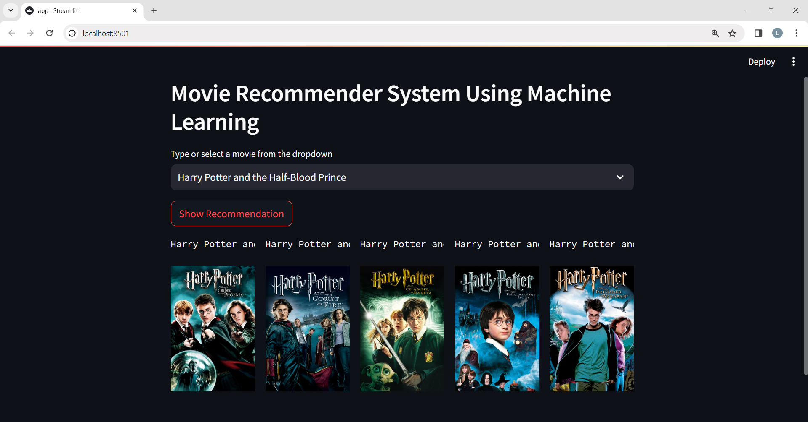

# Project: Movie Recommender System Using Machine Learning!


Recommender systems are becoming increasingly popular in today's busy world. People are always short on time due to the many tasks that need to be completed in 24 hours.Recommendation systems are essential as they assist users in making informed decisions without consuming their own cognitive faculties.

A recommender system serves the purpose of understanding individual interests and curating a personalized list of relevant and engaging content for each user. Developing such a system involves extensive considerations. It utilizes artificial intelligence algorithms to assess various options and compile a tailored selection of items that align with the user's preferences. These recommendations are generated by analyzing the user's profile, browsing history, as well as observing the viewing habits of others with similar traits or demographics. Predictive models and heuristics are employed to leverage available data and optimize the recommendation process.

# Types of Recommendation System :

### 1 ) Content Based :

- Content-based systems, which use characteristic information and takes item attriubutes into consideration .

- Twitter , Youtube .

- Which music you are listening , what singer are you watching . Form embeddings for the features .
	
- User specific actions or similar items reccomendation .
	
- It will create a vector of it .
	
- These systems make recommendations using a user's item and profile features. They hypothesize that if a user was interested in an item in the past, they will once again be interested in it in the future
	
- One issue that arises is making obvious recommendations because of excessive specialization (user A is only interested in categories B, C, and D, and the system is not able to recommend items outside those categories, even though they could be interesting to them).

### 2 ) Collaborative Based :
		
- Collaborative filtering systems, which are based on user-item interactions.
	
- Clusters of users with same ratings , similar users .
	
- Book recommendation , so use cluster mechanism .
	
- We take only one parameter , ratings or comments .
	
- In short, collaborative filtering systems are based on the assumption that if a user likes item A and another user likes the same item A as well as another item, item B, the first user could also be interested in the second item . 
	
- Issues are :

	- User-Item nXn matrix , so computationally expensive .

	- Only famous items will get reccomended .

	- New items might not get reccomended at all .   

### 3 ) Hybrid Based :
	
- Hybrid systems, which combine both types of information with the aim of avoiding problems that are generated when working with just one kind.

- Combination of both and used now a days .

- Uses : word2vec , embedding .           

# About this project:

This is a streamlit web application that can recommend various kinds of similar movies based on an user interest.
here is a demo,

# Demo:





# Dataset has been used:

* [Dataset link](https://www.kaggle.com/tmdb/tmdb-movie-metadata?select=tmdb_5000_movies.csv)

# Concept used to build the model.pkl file : cosine_similarity

1 . Cosine Similarity is a metric that allows you to measure the similarity of the documents.

2 . In order to demonstrate cosine similarity function we need vectors. Here vectors are numpy array.

3 . Finally, Once we have vectors, We can call cosine_similarity() by passing both vectors. It will calculate the cosine similarity between these two.

4 . It will be a value between [0,1]. If it is 0 then both vectors are complete different. But in the place of that if it is 1, It will be completely similar.

5 . For more details , check URL : https://www.learndatasci.com/glossary/cosine-similarity/

# How to run?
### STEPS:

Clone the repository

```bash
https://github.com/Lingala-Deepak/Movie-Recommender-System-Using-Machine-Learning.git
```
### STEP 01- Create a conda environment after opening the repository

```bash
conda create -n movie python=3.7.10 -y
```

```bash
conda activate movie
```


### STEP 02- install the requirements
```bash
pip install -r requirements.txt
```


```bash
#run this file to generate the models

Movie Recommender System Data Analysis.ipynb
```

Now run,
```bash
streamlit run app.py
```


```bash
Author: Lingala Deepak
Data Scientist

```
